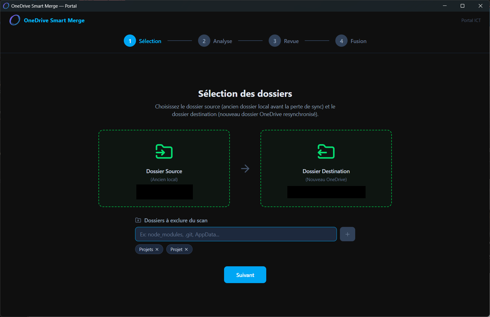
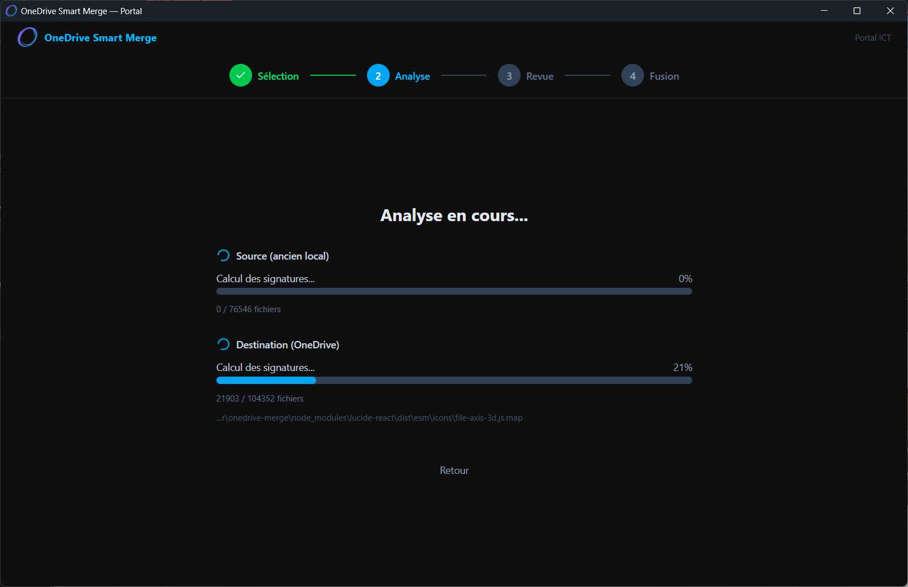
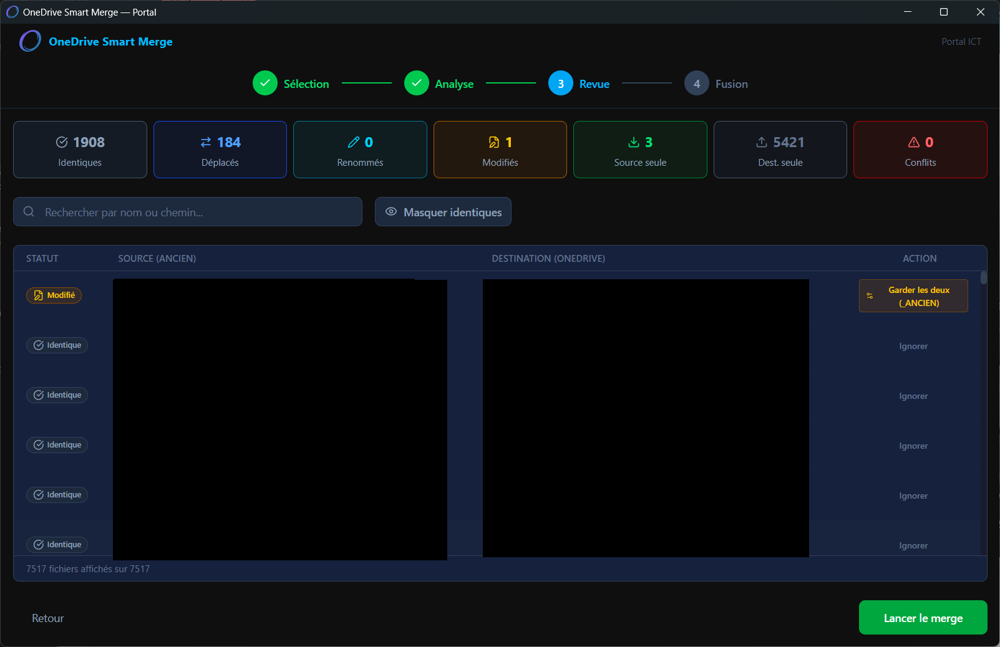
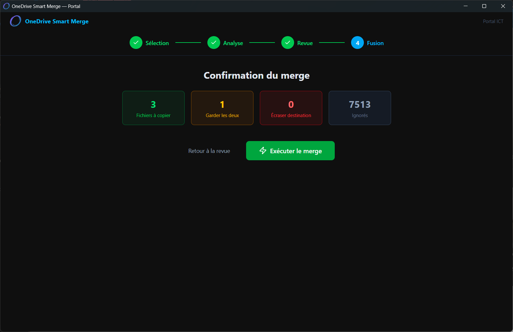

<p align="center">
  
</p>

<h1 align="center">OneDrive Smart Merge</h1>

<p align="center">
  <strong>Outil de fusion intelligente de dossiers OneDrive pour les environnements Microsoft 365</strong>
</p>

<p align="center">
  
  
  
  
</p>

---

## Le problème

En environnement Microsoft 365 professionnel, la synchronisation OneDrive peut se casser silencieusement, notamment lors de :

- **Fusions de tenants Microsoft 365** (migrations inter-organisations)
- **Renommages de tenants** (via `SPO-Tenant Rename`, qui batch-rename toutes les URLs SharePoint/OneDrive)
- **Pertes de synchronisation silencieuses** qui passent inaperçues dans l'usage quotidien

Quand cela arrive, la procédure standard est de resynchroniser OneDrive depuis zéro. On se retrouve alors avec **deux dossiers** :

| Dossier              | Contenu                                                                                  |
| -------------------- | ---------------------------------------------------------------------------------------- |
| **Ancien local**     | L'ancien OneDrive avant la perte de sync (travail local potentiellement non synchronisé) |
| **Nouveau OneDrive** | Le dossier fraîchement resynchronisé depuis le cloud                                     |

Le risque : **perdre des fichiers** qui existaient uniquement en local, ou écraser des modifications cloud par d'anciennes versions locales.

## La solution

**OneDrive Smart Merge** compare intelligemment les deux dossiers en 4 passes et fusionne le tout **sans perdre une seule donnée** :

1. **Match par chemin** — Identifie les fichiers identiques au même emplacement
2. **Match par signature SHA-256** — Détecte les fichiers déplacés ou renommés
3. **Match par nom + taille** — Repère les fichiers modifiés nécessitant attention
4. **Fichiers orphelins** — Tout ce qui reste est copié vers la destination

> **Règle d'or** : en cas de doute, l'outil garde toujours les deux versions. Aucune donnée n'est jamais supprimée.

---

## Screenshots

### 1. Selection des dossiers

Choisissez le dossier source (ancien local) et la destination (nouveau OneDrive). Possibilite d'exclure certains patterns de fichiers.

<p align="center">
  
</p>

### 2. Analyse et scan

Scan parallele multi-thread de tous les fichiers avec calcul des signatures SHA-256 en temps reel.

<p align="center">
  
</p>

### 3. Revue des differences

Vue detaillee de toutes les differences detectees avec filtres par categorie. Chaque conflit peut etre resolu individuellement.

<p align="center">
  
</p>

### 4. Confirmation et execution

Recapitulatif des operations avant execution. Le merge s'execute avec un log en temps reel.

<p align="center">
  
</p>

---

## Telecharger

Rendez-vous dans la section [**Releases**](../../releases) pour telecharger les executables :

| Fichier                                | Architecture       | Type            |
| -------------------------------------- | ------------------ | --------------- |
| `OneDrive-Smart-Merge_x64-setup.exe`   | Intel/AMD 64-bit   | Installeur NSIS |
| `OneDrive-Smart-Merge_x64.exe`         | Intel/AMD 64-bit   | Portable        |
| `OneDrive-Smart-Merge_ARM64-setup.exe` | ARM64 (Snapdragon) | Installeur NSIS |
| `OneDrive-Smart-Merge_ARM64.exe`       | ARM64 (Snapdragon) | Portable        |

> **Prerequis** : Windows 10/11 avec WebView2 (inclus par defaut sur les installations recentes).

---

## Stack technique

### Pourquoi ces choix ?

| Technologie                                           | Role                        | Pourquoi                                                                                                                                                |
| ----------------------------------------------------- | --------------------------- | ------------------------------------------------------------------------------------------------------------------------------------------------------- |
| **[Tauri v2](https://v2.tauri.app/)**                 | Framework desktop           | Exe leger (~8 Mo), performances natives, acces filesystem complet. Alternative moderne a Electron sans embarquer Chromium.                              |
| **Rust**                                              | Backend (scan, hash, merge) | Performances maximales pour le hashing SHA-256 parallelise sur des dizaines de milliers de fichiers. Zero-cost abstractions, securite memoire garantie. |
| **[Rayon](https://docs.rs/rayon/)**                   | Parallelisme                | Hashing multi-thread automatique sur tous les cores CPU. Critique pour traiter 100k+ fichiers en quelques minutes.                                      |
| **React 18 + TypeScript**                             | Frontend                    | UI reactive avec typage strict. Ecosysteme riche pour les composants.                                                                                   |
| **[TanStack Virtual](https://tanstack.com/virtual/)** | Virtualisation de liste     | Obligatoire pour afficher 50k+ fichiers sans exploser le DOM. Ne rend que les ~40 lignes visibles.                                                      |
| **[Zustand](https://zustand-demo.pmnd.rs/)**          | State management            | Store global leger et simple, parfait pour un wizard multi-etapes.                                                                                      |
| **[Tailwind CSS](https://tailwindcss.com/)**          | Styling                     | Dark mode exclusif avec un theme Portal custom. Developpement rapide.                                                                                   |
| **[Lucide React](https://lucide.dev/)**               | Icones                      | Set d'icones modernes et consistantes.                                                                                                                  |

---

## Architecture

```
onedrive-merge/
├── src-tauri/              # Backend Rust
│   ├── src/
│   │   ├── commands/       # Commandes Tauri (scan, analyze, merge)
│   │   ├── core/           # Logique metier (scanner, hasher, analyzer, merger)
│   │   └── utils/          # Utilitaires (chemins longs Windows)
│   └── icons/              # Icones de l'application
├── src/                    # Frontend React
│   ├── components/         # Composants UI (Stepper, FileTable, ConflictResolver...)
│   ├── stores/             # Zustand store
│   ├── hooks/              # Hooks custom (useScan, useAnalysis, useMerge)
│   └── types/              # Types TypeScript
├── release/                # Executables compiles
└── screenshots/            # Captures d'ecran
```

---

## Fonctionnalites

- **Scan parallele multi-thread** — Utilise tous les cores CPU via Rayon pour hasher des milliers de fichiers simultanement
- **Detection intelligente en 4 passes** — Identifie les fichiers identiques, deplaces, renommes, modifies et orphelins
- **Liste virtualisee** — Affiche 50k+ fichiers sans ralentissement grace a TanStack Virtual
- **Resolution de conflits** — Interface visuelle pour comparer et choisir entre deux versions d'un meme fichier
- **Mode dry-run** — Previsualisation de toutes les operations avant execution
- **Gestion des cas edge Windows** — Chemins longs (>260 chars), fichiers verrouilles, caracteres speciaux (accents), permissions
- **Rapport d'execution** — Export JSON detaille de toutes les operations effectuees
- **Exclusion par pattern** — Ignore automatiquement les fichiers temporaires (`~$*`, `.tmp`, `Thumbs.db`, etc.)

---

## Avertissement important

> **Bande passante reseau** : dans le cas de grosses bibliotheques OneDrive, l'outil doit telecharger tous les fichiers cloud pour calculer leurs signatures et les comparer. Soyez conscient de l'impact sur la bande passante de votre reseau avant de lancer un scan sur un OneDrive volumineux.

> **Sauvegarde** : bien que l'outil soit concu pour ne jamais supprimer de donnees, il est toujours recommande de faire une sauvegarde avant toute operation de merge.

---

## Compiler depuis les sources

### Prerequis

- [Node.js](https://nodejs.org/) 18+
- [Rust](https://rustup.rs/) (stable)
- [Visual Studio Build Tools 2022](https://visualstudio.microsoft.com/downloads/) avec le workload C++

### Installation

```bash
git clone https://github.com/portal-ict/onedrive-smart-merge.git
cd onedrive-smart-merge
npm install
npm run tauri dev
```

### Build de production

```bash
npm run tauri build
```

Les executables sont generes dans `src-tauri/target/release/bundle/`.

---

## Contexte

Cet outil est ne d'une experience terrain en tant qu'administrateur ICT gerant des environnements Microsoft 365 pour des organisations en Belgique.

Lors de fusions et renommages de tenants Microsoft 365, la synchronisation OneDrive — notamment du Bureau, Documents et Images — s'est averee etre un veritable casse-tete. La procedure de `SPO-Tenant Rename` batch-rename toutes les URLs SharePoint et OneDrive, provoquant des pertes de synchronisation silencieuses qui ne sautent pas aux yeux dans l'usage quotidien.

Apres avoir gere ces situations avec des scripts manuels et beaucoup de prudence, j'ai cree cet outil pour automatiser et securiser le processus de fusion, avec une regle absolue : **ne jamais perdre une seule donnee**.

## Pourquoi cet outil existe

Soyons clairs : Microsoft a fait un excellent travail sur OneDrive et sur les mecanismes de renommage de tenant. Le `SPO-Tenant Rename` fonctionne remarquablement bien pour ce qu'il fait, et OneDrive reste un outil de synchronisation puissant au quotidien.

Mais quand on se retrouve avec deux dossiers a fusionner apres une resynchronisation — l'ancien local et le nouveau cloud — il n'existe tout simplement **aucun outil adapte**. J'ai cherche. Longuement. Les solutions existantes sont soit des outils de sync bidirectionnelle (pas le besoin), soit des diff de fichiers (pas assez intelligent), soit des scripts PowerShell maison (pas assez robuste pour 100k fichiers).

Un outil de merge visuel, qui detecte les deplacements et renommages par hash, qui gere les conflits avec une interface claire, et qui garantit zero perte de donnees — ca n'existait pas. Alors je l'ai construit.

---

## Contact

**Portal ICT** — [info@leportal.eu](mailto:info@leportal.eu)

---

## Licence

Ce projet est distribue sous la licence **GNU Affero General Public License v3.0 (AGPL-3.0)**. Vous etes libre de consulter, forker, modifier et redistribuer le code, a condition que toute version modifiee soit egalement distribuee sous AGPL-3.0. Voir le fichier [LICENSE](LICENSE) pour les details.
